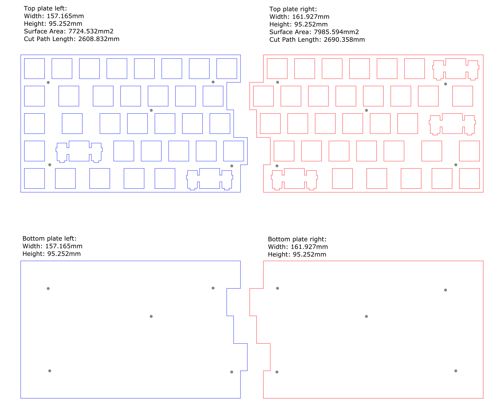

# UNK Build Logs

My own version of <a href="https://ultimatehackingkeyboard.com/">Ultimate Hacking Keyboard</a>

### Goals

- Splitted-staggered keyboard
- Handwired
- Fully programmable
- Almost zero learning curve (~ortholinear~, ~symbols through modifier/layer~)
- Ergonomic as UHK
- Generic size of keycaps (any 75-80% keycap set should be fitted)
- Interchangable middle modules (touchpad, trackball, smartphone dock)

### Design

- Combined plate: http://www.keyboard-layout-editor.com/#/gists/457787e3b1938c4cbe9d65c7b7bd31ef
- Left plate: http://www.keyboard-layout-editor.com/#/gists/f117f3cbc2d0b1bf17206992068f9017
- Right plate: http://www.keyboard-layout-editor.com/#/gists/e9e79566d1be71f77f1f2d33660011e5

### Parts

- Existing keycaps set from a Vortex Tab 75 keyboard
- Gateron Brown switches, 68 @ Rp 2.400 = Rp 163.200
- Pro micro ATMEGA32U4 16Mhz 5V, 2 @ Rp 52.800 = Rp 105.600
- Top and bottom plate + laser cutting service at <a href="https://www.instagram.com/laserindonesia/">Laser Indonesia</a> = Rp 463.000
